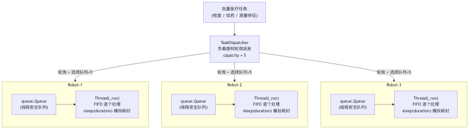
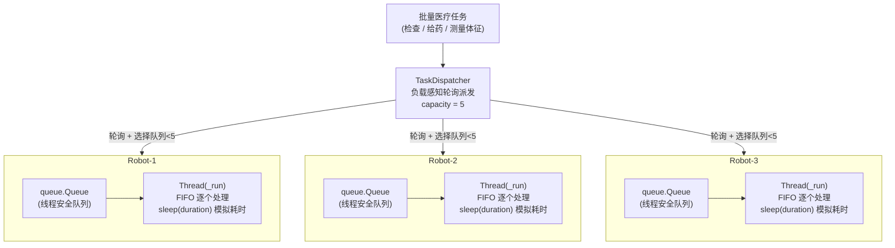
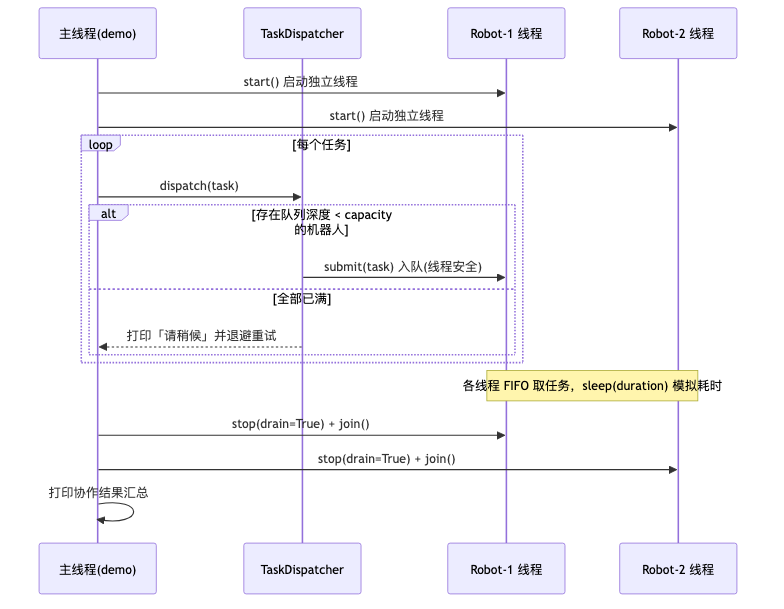
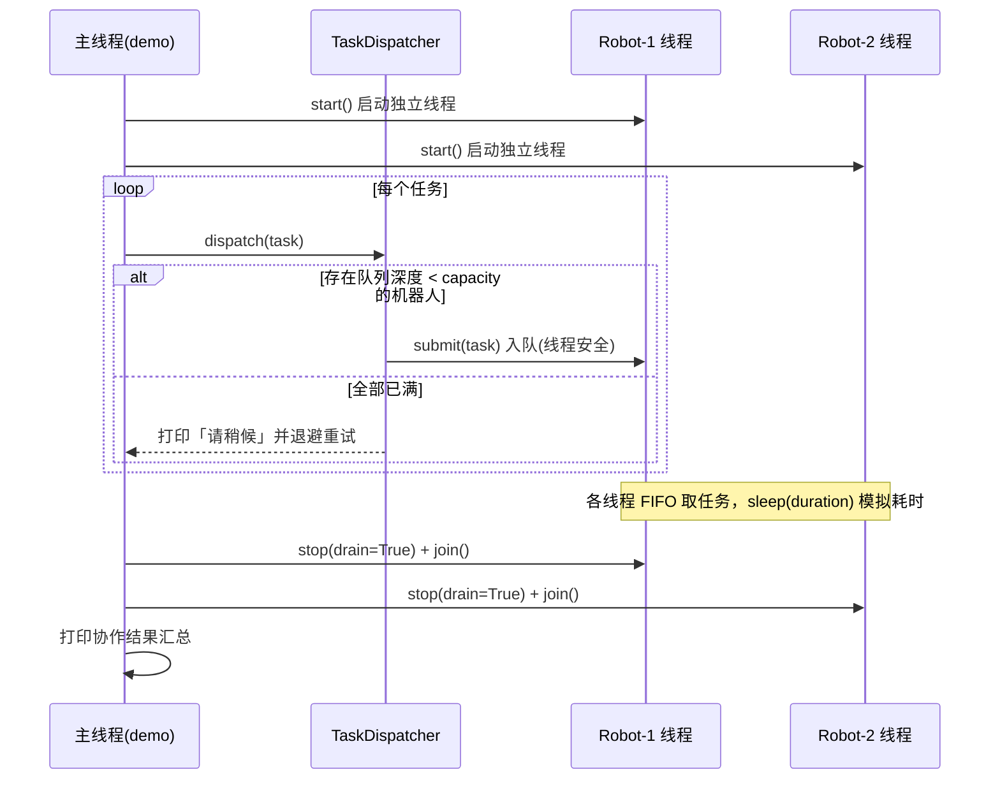

# 多智能体的医疗机器人 Demo

构建多智能体协作的医疗机器人系统，核心目标是实现医疗任务的高效分配与协同执行。系统包含**医疗机器人类**与**任务管理类**：

- 医疗机器人具备独立的任务队列与线程安全机制，支持任务接收、处理及停止操作，处理过程模拟实际耗时；
- 任务管理器基于轮询算法分配任务，优先选择队列任务数少于 5 的机器人，若所有机器人队列已满则提示等待；
- 系统创建多个机器人实例并启动独立线程，批量分配检查患者、给药、测量生命体征等医疗任务，任务完成后统一停止机器人，确保多智能体间的协作与线程安全。

## 总体设计

本示例用 Python **标准库**（`threading` / `queue` / `logging`）演示「多智能体协作」的核心思想，不依赖任何第三方运行时库，方便课堂与终端直接运行。这里的「智能体（agent）」指**自治的并发工作单元**：每个机器人独立持有任务队列、独立线程消费任务，互不阻塞。





### 角色与职责

| 模块 | 类 | 职责 |
|------|-----|------|
| `medical_task.py` | `TaskType` / `MedicalTask` | 任务模型：任务类型枚举 + 携带耗时的任务数据 |
| `robot.py` | `MedicalRobot` / `RobotStats` | 智能体：独立队列 + 独立线程消费 + 优雅停机 + 统计 |
| `dispatcher.py` | `TaskDispatcher` | 任务管理器：负载感知轮询派发 + 队满等待 |
| `demo.py` | — | 编排入口：建机器人 → 批量派发 → 统一停机 → 结果汇总 |

### 任务派发与执行时序





### 关键设计决策

- **一机器人一线程 + 自带 `queue.Queue`**：`Queue` 本身线程安全，派发者（生产者）与机器人（消费者）无需额外加锁即可并发收发任务，满足「每个机器人有独立任务队列与线程」的要求。
- **负载感知轮询派发**：`TaskDispatcher` 维护一个轮询游标，每次从游标位置起找到第一个「队列深度 < 容量阈值(默认 5)」的机器人；若全部已满，则打印「请稍候」并退避重试，绝不强行超载某个机器人。
- **优雅停机（哨兵 + Event）**：Python 无法安全地强杀线程，因此 `stop()` 设置 `threading.Event` 并向队列投入一个哨兵对象（`_STOP = object()`），使空闲阻塞的机器人能立即被唤醒退出。
  - `stop(drain=True)`（默认）：**处理完已排队任务后**再退出；
  - `stop(drain=False)`：**放弃**队列中剩余任务，仅完成正在处理的那一个后退出（紧急停机场景）。
  - 主线程随后 `join()` 确保无线程泄漏。
- **统计仅由工作线程写入**：`RobotStats`（已处理 / 已放弃 / 忙碌秒数）只在机器人自己的线程内累加，主线程在 `join()` 之后读取，天然避免数据竞争，无需额外加锁。
- **`qsize()` 仅作负载提示**：高并发下 `Queue.qsize()` 是近似值，用于软负载均衡足够；本示例据此做选择而不追求精确计数，以保持简单。
- **集中式带时间戳日志**：日志带时间戳与线程名，让「哪个机器人在何时处理了哪个任务」一目了然，使并发协作可观测。

## 目录结构

```
medical-robot-demo/
├── medical_task.py   # 任务模型：TaskType 枚举 + MedicalTask 数据类
├── robot.py          # MedicalRobot：自带队列与线程的机器人智能体 + 优雅停机 + 统计
├── dispatcher.py     # TaskDispatcher：负载感知轮询派发 + 队满等待
├── demo.py           # 编排入口：建机器人 → 批量派发 → 统一停机 → 结果汇总
├── test_medbot.py    # 场景验证(unittest)：收发/顺序处理/优雅停机/放弃/轮询/队满等待/统计
├── pyproject.toml    # Poetry 配置（运行时仅用标准库）
└── README.md
```

## 运行

环境要求：Python 3.9 ~ 3.12。无需安装第三方依赖，直接运行：

```bash
python demo.py                                   # 默认 3 机器人 / 15 任务 / 容量 5
python demo.py --robots 4 --tasks 20 --capacity 5
python demo.py --robots 1 --tasks 6 --capacity 2 # 易触发「队列已满，请稍候」
```

可选参数：

| 参数 | 含义 | 默认 |
|------|------|------|
| `--robots` | 机器人数量 | 3 |
| `--tasks` | 批量医疗任务数量 | 15 |
| `--capacity` | 单机器人队列容量阈值（低于它才会被派发） | 5 |
| `--seed` | 随机种子（可复现任务序列） | 42 |
| `--no-color` | 禁用彩色输出（重定向到文件时会自动禁用） | 关闭 |

也可用 Poetry 管理虚拟环境：

```bash
poetry install
poetry run python demo.py
```

## 输出示例

运行日志按**机器人着色**（每个 Robot 固定一种颜色）、按**事件着色**（派发/开始处理为机器人色、完成为绿色、队满告警为黄色），让并发协作一眼可辨：

```
21:00:53 │ MainThread │ 派发 #1 测量生命体征(病房102, 0.3s) → Robot-1 (队列深度=1)
21:00:53 │ MainThread │ 派发 #2 给药(病房104, 0.5s) → Robot-2 (队列深度=1)
...
21:00:53 │ Robot-1    │ Robot-1 ▶ 开始处理 #1 测量生命体征(病房102, 0.3s)
21:00:54 │ Robot-1    │ Robot-1 ✔ 完成 #1 测量生命体征(病房102, 0.3s)
...
21:00:56 │ Robot-3    │ Robot-3 已停止 (处理 4 / 放弃 0)
21:00:57 │ MainThread │ 所有机器人已安全停止，演示结束。
```

结束后打印一张对齐的**协作结果汇总表**，含每台机器人的负载条形图与整体加速比：

```
═════════════════════ 协作结果汇总 ═════════════════════
  机器人        已处理  已放弃   忙碌(s)  负载分布
  ────────────────────────────────────────────────────────
  Robot-1            4       0       2.9  ████████████████
  Robot-2            4       0       2.0  ███████████
  Robot-3            4       0       2.7  ███████████████
  ────────────────────────────────────────────────────────
  合计              12       0       7.6

  ⏱  墙钟耗时 2.9s  vs  串行预计 7.6s   →   加速比 2.6×
  已处理 12/12 个任务，放弃 0 个
```

汇总表直观体现了多智能体协作的价值：**墙钟耗时（2.9s）远小于串行预计耗时（7.6s），加速比约 2.6×**，且任务在机器人间被均匀分摊（负载条长度相近）。

队列全满时会看到背压（back-pressure）提示：

```
所有机器人队列已满(容量=2)，请稍候 0.5s 后重试...
```

## 测试

场景验证测试覆盖任务收发、顺序处理、模拟耗时、优雅停机、紧急停机放弃任务、统计、轮询均衡、队满等待、整队编排等：

```bash
python -m unittest test_medbot -v
```

预期 10 个用例全部通过。

## 已知限制

- 仅为教学演示：任务是「模拟工作」（`time.sleep`），不含真实医疗决策、诊断或设备对接。
- `Queue.qsize()` 为近似值，仅作软负载均衡提示，不保证精确。
- 单进程内存内运行，不涉及多进程、网络或持久化。
